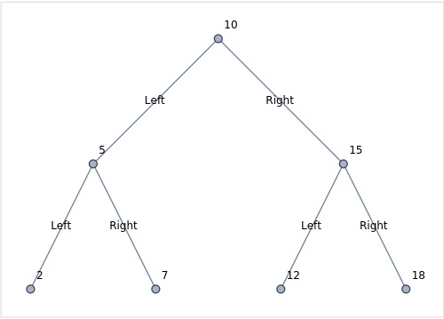

# **Binary Search Tree in Golang** 

This repository contains an implementation of a Binary Search Tree (BST) in Golang. 
The codebase demonstrates the basic operations of a BST, including insertion and in-order traversal. 
The implementation is simple, yet effective, and serves as a great starting point for anyone looking to understand the fundamentals of BSTs.
 
 

**Features:** 
-Node structure to represent each node in the BST. 
-Insertion of nodes into the BST. 
-In-order traversal of the BST. 
In a nutshell : 
A node can have at most 2 child nodes . 
*One child node on the left , containing values less than the node . 
*One child node on the right , containing values greater than the node .  
*A node can also have just one child, either on the left or either on the right . 
*A node can also have no children, it is then reffered as a 'leaf node '.  

Here is a drawing of the binary search tree structure  for our particular case : 
 

  
source: Wolfram ChatGPT plugin . 
 

*How to Run* 

Clone this repository to your local machine. 
Navigate to the directory containing the main.go file. 
Run  `go run main.go` . 
 

The output should be as follows :   
 

`2 5 7 10 12 15 18` 

